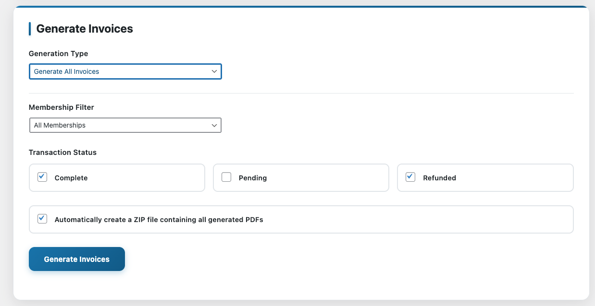

# MemberPress Bulk Invoice Generator

**Version:** 1.0.0  
**Requires at least:** 5.0  
**Tested up to:** 6.8  
**Stable tag:** 1.0.0  
**License:** GPLv2 or later  
**License URI:** https://www.gnu.org/licenses/gpl-2.0.html

Generate bulk PDF invoices for MemberPress transactions.



## Description

This plugin extends the functionality of MemberPress and the MemberPress PDF Invoice add-on by providing a convenient admin interface to generate PDF invoices for multiple transactions at once. It supports both generating invoices for all transactions and generating invoices for a specific time period.

## Features

- **User-friendly Admin Interface**: Clean, intuitive interface integrated into the MemberPress admin menu
- **Flexible Generation Options**: 
  - Generate invoices for all transactions
  - Generate invoices for a specific date range
- **Transaction Status Filtering**: Choose which transaction statuses to include (Complete, Confirmed, Pending, Refunded)
- **Real-time Statistics**: View transaction counts before generation
- **Batch Processing**: Efficiently handles large datasets by processing transactions in small batches to avoid timeouts
- **Visual Progress Tracking**: Real-time progress bar with detailed statistics during generation
- **Automatic ZIP Creation**: Option to automatically create a ZIP file containing all generated PDFs for easy download
- **Error Handling**: Detailed error reporting for failed generations
- **Security**: Proper nonce verification and capability checks
- **Performance Optimization**: Minified CSS and JavaScript for faster loading
- **WordPress Standards**: Compliant with WordPress coding standards

## Requirements

- WordPress 5.0 or higher
- MemberPress plugin (active)
- MemberPress PDF Invoice add-on (active)
- PHP 7.4 or higher
- PHP ZipArchive extension (for ZIP file creation)

## Development Setup

For development and building minified assets:

- Node.js 14 or higher
- npm (comes with Node.js)

See [BUILD.md](BUILD.md) for detailed build instructions.

## File Structure

```
memberpress-bulk-invoice-generator/
├── memberpress-bulk-invoice-generator.php (Main plugin file)
├── assets/
│   ├── css/
│   │   ├── admin.css (Source styles)
│   │   └── admin.min.css (Minified styles)
│   └── js/
│       ├── admin.js (Source functionality)
│       └── admin.min.js (Minified functionality)
├── screenshots/
│   └── dashboard.png (Plugin interface screenshot)
├── install.php (Installation script)
├── uninstall.php (Cleanup script)
├── README.md (Documentation)
├── CHANGELOG.md (Version history)
├── LICENSE (GPL v2.0 license)
└── composer.json (Composer configuration)

**Development files (not included in releases):**
- `package.json` - Node.js dependencies
- `webpack.config.js` - Build configuration
- `build.sh` - Build script
- `BUILD.md` - Build documentation

## Release Process

To create a release:
1. Run `npm run build` to generate minified assets and create release ZIP
2. The build script automatically creates a ZIP file excluding development files and screenshots
3. Upload the generated ZIP from `release/` folder to WordPress plugin repository or distribute manually

**Note:** Screenshots are included in the GitHub repository for documentation but excluded from release ZIP files to keep the distribution package clean.
```

## Installation

1. **Upload the Plugin**:
   - Upload the `memberpress-bulk-invoice-generator` folder to your `/wp-content/plugins/` directory
   - Or zip the folder and upload via WordPress admin

2. **Activate the Plugin**:
   - Go to **Plugins** > **Installed Plugins**
   - Find "MemberPress Bulk Invoice Generator" and click **Activate**

3. **Verify Dependencies**:
   - Ensure MemberPress is active
   - Ensure MemberPress PDF Invoice add-on is active
   - The plugin will show an error notice if dependencies are missing

## Usage

### Accessing the Tool

1. Go to **MemberPress** > **Bulk Invoice Generator** in your WordPress admin
2. The tool will be available under the MemberPress menu

### Generating All Invoices

1. Select **"Generate All Invoices"** from the Generation Type dropdown
2. Choose which transaction statuses to include (Complete, Confirmed, Pending, Refunded)
3. Check or uncheck **"Create ZIP File"** option (recommended for easy download)
4. Click **"Generate Invoices"**
5. Watch the progress bar as transactions are processed in batches
6. Wait for the process to complete
7. Check the results section for success/error messages
8. Download the ZIP file if created

### Generating Invoices for a Specific Period

1. Select **"Generate Invoices for Specific Period"** from the Generation Type dropdown
2. Set the **Start Date** and **End Date** (with time if needed)
3. Choose which transaction statuses to include (Complete, Confirmed, Pending, Refunded)
4. Check or uncheck **"Create ZIP File"** option
5. Click **"Generate Invoices"**
6. Watch the progress bar as transactions are processed in batches
7. Wait for the process to complete
8. Check the results section for success/error messages
9. Download the ZIP file if created

## File Locations

### Generated PDF Files
Generated PDF invoices are saved in:
```
wp-content/uploads/mepr/mpdf/
```

### Generated ZIP Files
ZIP files (when enabled) are saved in:
```
wp-content/uploads/mepr/mpdf/memberpress-invoices-YYYY-MM-DD-HH-MM-SS.zip
```

## Important Notes

### Before Running
- **Download Existing Files**: If you've run the generator before, download the existing PDF files from `wp-content/uploads/mepr/mpdf/` before running again
- **File Overwriting**: New generations will overwrite existing files with the same names
- **Batch Processing**: Large numbers of transactions are processed efficiently in small batches
- **ZIP Files**: Enable ZIP creation for easier file management and download

### Transaction Statuses
Only transactions with these statuses will be processed:
- **Complete**: Successfully completed transactions
- **Confirmed**: Confirmed transactions
- **Pending**: Pending transactions (awaiting payment confirmation)
- **Refunded**: Refunded transactions

## Troubleshooting

### Common Issues

1. **"MemberPress PDF Invoice add-on is not active"**
   - Ensure the MemberPress PDF Invoice add-on is installed and activated
   - Check that it's compatible with your MemberPress version

2. **"No transactions found"**
   - Verify that transactions exist in your MemberPress database
   - Check that the selected statuses match your transaction statuses
   - For period generation, ensure the date range includes transactions

3. **"Permission denied" errors**
   - Ensure you have administrator privileges
   - Check WordPress file permissions for the uploads directory

4. **PDF generation fails**
   - Verify that the `wp-content/uploads/mepr/mpdf/` directory exists and is writable
   - Check server memory limits for large batches
   - Ensure the MPDF library is properly installed

5. **ZIP creation fails**
   - Ensure PHP ZipArchive extension is installed and enabled
   - Check write permissions for the uploads directory
   - Verify sufficient disk space for ZIP file creation

## Support

For support and feature requests, please contact the plugin developer.

## License

This plugin is licensed under the GNU General Public License v2.0. See the LICENSE file for details.

## Credits

- Built for MemberPress
- Uses the MemberPress PDF Invoice add-on functionality
- jQuery UI Datepicker for date selection
- PHP ZipArchive for ZIP file creation
